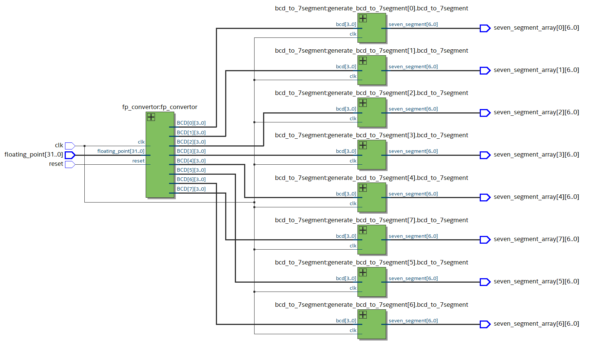

# Floating-Point-Convertor
Converts 32-bit binary to a seven-segment display floating point format using a state machine in System Verilog. The number of seven-segment display digits can vary from a minimum of 6 digits up to 60+ digits. For more information, check out: [TristonBabers.com/floating-point-convertor](https://tristonbabers.com/projects/floating-point-convertor/).

## RTL Diagram

## Setup
**Simulation:** ModelSim - INTEL FPGA STARTER EDITION 10.5b [[download](https://www.intel.com/content/www/us/en/software-kit/750368/modelsim-intel-fpgas-standard-edition-software-version-18-1.html)]

**Synthesis:** Quartus Prime 22.1std Lite Edition [[download](https://www.intel.com/content/www/us/en/software-kit/757262/intel-quartus-prime-lite-edition-design-software-version-22-1-for-windows.html)]
- To setup ModelSim for synthesis, make a new project containing the SystemVerilog files in the verilog folder.
- Run the simulation using the toplevel_tb.sv file as the test bench, and the results will appear in the same directory in "output_file.txt".
- For synthesis, use top_level.sv as the highest level module, and pick the ARIA II board option in the new project wizard.

## License

Source code is licensed under the [MIT license](http://opensource.org/licenses/mit-license.php).
